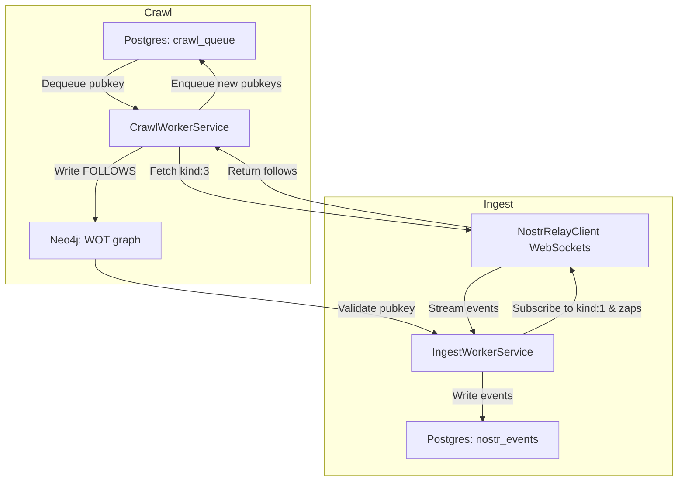

# Nostr WOT Experiment

> **Experimenting with Nostr**  
> A fun, hands‑on exploration of the Nostr protocol using C#/.NET after an 18‑month hiatus.

---

## 🚀 What Is This?

This repo is my playground for learning and experimenting with **Nostr** (“Notes and Other Stuff Transmitted by Relays”). It’s a lightweight Web‑of‑Trust crawler and event ingestor:

- **Seed** a single pubkey (for example, Jack Dorsey’s)  
- **Recursively** build your trust graph (“follows” relationships via `kind:3` events)  
- **Ingest** high‑signal events (`kind:1` notes and `kind:9735` zaps) only from trusted pubkeys  
- **Persist** the graph in Neo4j and events in Postgres (also acting as the durable queue)  

Think of it as a “signal‑only” Nostr mirror—no noise, no spam, just the voices you trust.

---

## 🎯 Why .NET?

I haven’t touched .NET for over 18 months. I almost reached for Go… but figured:

- Perfect excuse to brush up on C# and the latest .NET  
- Leverage built‑in DI, background services, EF Core (if you like), and a rich ecosystem  
- See how the modern .NET developer experience stacks up for protocol‑level work  

So here we are—back in Visual Studio land and loving every minute of it.

---

## 🏗️ Architecture Overview



- **Postgres**  
  - `crawl_queue`: durable job queue for pubkeys  
  - `nostr_events`: JSONB storage for ingested events  
- **Neo4j**  
  - Persists your Web‑of‑Trust as a graph of `User` nodes and `FOLLOWS` edges  
- **.NET Worker Services**  
  - `CrawlWorkerService` – pulls pubkeys → fetches contact lists → updates the graph  
  - `IngestWorkerService` – subscribes to trusted pubkeys → streams & stores notes/zaps  
- **NostrRelayClient** – a simple WebSocket wrapper to talk to any Nostr relay  

---

## 🔧 Prerequisites

- [.NET 8 SDK](https://dotnet.microsoft.com/download)  
- [PostgreSQL 14+](https://www.postgresql.org/) with the `vector` extension installed (for future embeddings)  
- [Neo4j 5+](https://neo4j.com/) (Community or Enterprise)  
- A running Nostr relay (e.g. `wss://relay.camus.network`)  

---

## 🛠️ Getting Started

1. **Clone this repo**  
   ```bash
   git clone https://github.com/mattcrooks/nostrsure.git
   cd nostr-wot-experiment
   ```
2. **Configure**  
   - Copy `appsettings.json.example` → `appsettings.json`  
   - Fill in your Postgres and Neo4j connection strings, plus seed pubkey(s) and relay URLs  
3. **Run the crawler**  
   ```bash
   cd src/NostrCrawler.Infrastructure
   dotnet run --project NostrCrawler.Infrastructure.csproj
   ```
4. **Watch the logs**  
   You’ll see pubkeys dequeued, contact lists fetched, and graph edges created in Neo4j.  
5. **Run the ingestor**  
   In a separate terminal:
   ```bash
   dotnet run --project src/TBA
   ```
6. **Query the API**  
   ```bash
   cd src/NostrCrawler.Api
   dotnet run
   ```
   - `GET /api/wot/{pubkey}` → your Web‑of‑Trust  
   - `GET /api/feed/{pubkey}` → recent notes from trusted nodes  

---

## 🎉 Next Steps

- Hook up **pgvector** and Semantic Kernel for vector search over your notes: or not, I wouldn't mind experimenting with Neo4j's vector capabilities instead  
- Implement **trust‑scoring** and filter by zaps or reciprocity  
- Build a simple **React** or **MAUI** front end to visualize your graph  
- Explore **relay reputation** metrics and auto‑pruning  

---

## 🙌 Contributing & Feedback

This is a personal experiment—feel free to ⭐ the repo, file issues, or send PRs if you spot something cool (or broken). Let’s demystify Nostr together!

---

## 📄 License

MIT © Matt Crooks  
